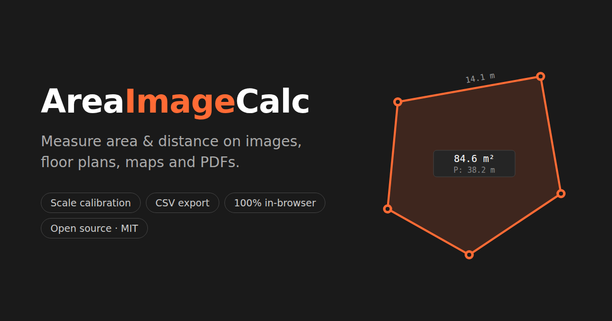

# AreaImageCalc

**Measure area and distance on images, floor plans, maps, and PDFs — free, in your browser.**

**[Open the app](https://areaimagecalc.pages.dev/)** · no install, no sign-up



AreaImageCalc turns any picture into something you can measure. Drop in a floor plan, a site map, an aerial photo, or a scanned PDF, click two points of known distance to set the scale, and every shape you draw reports its real-world area, perimeter, and length — ready to export as CSV for a spreadsheet. It is built for the kind of job where tracing a region on an image beats visiting it with a tape measure: estimating flooring or paint from a plan, sizing a lawn or roof from a satellite view, quantifying regions in scanned documents or lab images.

Everything runs locally in your browser. After the page loads, the app makes no network calls; images and projects never leave your device. It is open source under the MIT license, works offline, and can be installed as a PWA or run from a folder of static files.

## Quick Start

1. Open the [live app](https://areaimagecalc.pages.dev/) (or `index.html` locally)
2. Drop an image or PDF, click **Open**, or paste with `Ctrl+V`
3. *(Optional)* Press `S` (**Scale**) and click two points of known distance to enable real-world units
4. Draw with **Polygon** `P` or **Freehand** `F`, or measure a path with **Distance** `D` — tools stay active until `Esc`
5. Read per-shape and total measurements in the Shapes panel
6. **Save** an `.arcalc.html` project file, or **Export** measurements as CSV / JSON

## Highlights

- **Real-world units** — calibrate from a known distance, a known area, or a known square; supports mm, cm, m, in, ft, yd
- **Drawing tools** — polygon, freehand tracing with live fill, and open-path distance measurement, with live side-length, area, and perimeter labels that avoid overlapping
- **PDF support** — pick pages from a thumbnail grid; pages render lazily and group under one document in the sidebar
- **Perspective correction** — de-skew photos taken at an angle, manually or automatically via square calibration; the result is never cropped
- **Organize** — tabs per document; group shapes with subtotals; reorder, rename, recolor, hide, and annotate with pinned notes
- **Full undo/redo** per document, including image transforms
- **Portable projects** — a saved project is a single self-describing HTML file that opens in any browser on double-click
- **Works everywhere** — mouse, keyboard, and touch (one-finger draw, two-finger pan and pinch-zoom); sessions auto-save and restore on reload

## Tools

| Tool | Key | Description |
|------|-----|-------------|
| Scale | `S` | Click two points of a known distance; drag endpoints to fine-tune before confirming |
| Polygon | `P` | Click to place vertices; close via first point, double-click, `Enter`, or right-click |
| Freehand | `F` | Drag to trace; live fill shows the region; release to finish |
| Distance | `D` | Click points along a path; finish with double-click, `Enter`, or right-click |
| Move | `M` | Drag a whole shape to reposition it; arrow keys nudge (`Shift` = 10×) |
| Edit | `E` | Drag grab rings to move shape points, note pins, and scale endpoints |
| Label | `L` | Click a shape to rename it; click a note to edit its text |
| Note | `N` | Click to pin a text annotation (notes export with measurements) |
| Perspective | `W` | Drag four corner handles to de-skew the image |
| Square Cal | — | Perspective panel → **Square Cal** tab; click 4 corners of a known square |
| Rotate | — | 90° buttons or a custom-angle popup |

### Keyboard

| Key | Action |
|-----|--------|
| `S` `P` `F` `D` `M` `E` `L` `N` | Activate tool (toggle off if already active) |
| `1`–`6` | Numeric aliases for Scale / Polygon / Freehand / Distance / Edit / Perspective |
| `H` | Hide / show selected shape |
| `Ctrl+Z` / `Ctrl+Shift+Z` (or `Ctrl+Y`) | Undo / redo |
| `Backspace` | Remove last placed point while drawing; delete selected shape otherwise |
| `Space` + drag | Pan |
| `+` / `-` · `Ctrl+0` | Zoom in / out · fit image to view |
| `PgUp` / `PgDn` | Previous / next page of the current document |
| `Enter` | Finish Distance path · apply perspective / square calibration |
| `Escape` | Exit tool / cancel perspective / deselect |
| `?` | Show shortcut help |

### Mouse and Touch

| Input | Result |
|-------|--------|
| Scroll wheel | Zoom at cursor |
| Middle-click drag | Pan |
| Right-click | Finish the current path |
| Click a shape | Select it (repeated clicks cycle overlapping shapes) |
| Double-click a note pin | Edit its text |
| Double-click the scale line | Re-open calibration with the value prefilled |
| One finger | Use the active tool |
| Two fingers | Pan and pinch-to-zoom |

## Setting the Scale

Three ways to get real-world units:

- **Known distance** — press `S`, click two points on something of known length (a wall on a plan, a scale bar on a map), enter the distance and unit. Endpoints stay adjustable: drag them in **Edit** mode (the entered distance is kept and pixels-per-unit recalculates), or double-click the line to re-enter the value.
- **Known area** — draw a closed shape around a region of known area, open its shape menu (⋮ in the Shapes pane) → **Set scale from area…**, and enter the area.
- **Known square** — if the photo is skewed, enter Perspective mode (`W`) → **Square Cal** tab, click the four corners of a real-world square, and enter its side length. This corrects perspective *and* sets the scale in one step.

## Perspective Correction and Rotation

For photos taken at an angle, press `W` and drag the four corner handles until the reference grid matches the image distortion — a live preview shows the correction before you commit with **Apply**. The warp runs in a Web Worker so the UI stays responsive, and the output is never cropped; if a strong correction would balloon the raster, a uniform downscale is folded into the transform with all geometry kept consistent.

Rotation (90° buttons or a custom angle) always recomposes from the original image at the cumulative angle, so repeated rotations never blur or grow the canvas. Shapes and the scale line follow the image through both operations.

## Saving and Exporting

- **Project files** — **Save** writes `<name>.arcalc.html`, a single self-describing HTML document: double-clicking it opens a page with an "Open AreaImageCalc" button that hands the project straight back into the app. All tabs, images (WebP-compressed), shapes, notes, and scale round-trip. Older `.arcalc` and plain-JSON files still import, and the installed PWA registers as a handler for `.arcalc` files.
- **CSV** — one row per shape (`document, name, type, area, area_unit, length, length_unit, area_px2, length_px, text`), BOM-prefixed for spreadsheet apps.
- **JSON** — per-tab measurements with shape coordinates for downstream processing.

Sessions also auto-save to localStorage and restore on reload. Images are background-encoded to WebP to shrink the footprint; if a session outgrows the browser's storage (soft limit 5 MB, hard limit 10 MB), the app degrades gracefully — background-tab images are dropped first, and a badge plus modal prompt you to export a project file before anything is lost.

## Privacy

The hosted app collects no data. There are no analytics, no cookies, and no accounts; after the initial page load the app makes zero network calls (PDF.js is fetched from a CDN only the first time a PDF is opened). Everything you load or draw stays in your browser's local storage on your machine.

## Running Locally

No build step — plain ES modules served as static files:

```sh
git clone https://github.com/arrow501/AreaImageCalc.git
cd AreaImageCalc
npm run serve        # or any static file server
```

Requires a modern browser with ES modules, Canvas 2D, Web Workers, and localStorage. `createImageBitmap` and `OffscreenCanvas` are used when available and degrade gracefully.

## Development

Runtime dependencies are deliberately minimal: [jQuery](https://jquery.com/) (CDN), the [JetBrains Mono](https://fonts.google.com/specimen/JetBrains+Mono) font, and [PDF.js](https://mozilla.github.io/pdf.js/) lazy-loaded on first PDF open.

```sh
npm test           # Vitest unit tests (pure modules)
npm run test:e2e   # Playwright E2E (headless Chromium)
npm run test:all   # both
```

<details>
<summary><b>Architecture</b> — module responsibilities</summary>

The app is split into ES modules; `index.html` contains only the CSS and HTML shell. The module graph is a strict DAG (see `CLAUDE.md` for the layer diagram).

| File | Responsibility |
|------|----------------|
| `js/app.js` | Entry point: wires modules together, restores saved state |
| `js/constants.js` | Palette, save keys/versions, storage limits (pure) |
| `js/math.js` | Pure geometry: shoelace, distance, point-in-polygon, fit-scale |
| `js/handles.js` | Pure grab-ring layout: min hit size, collision displacement |
| `js/arcalcFormat.js` | Pure `.arcalc` HTML-polyglot encode / decode |
| `js/csv.js` | Pure measurements CSV builder |
| `js/color.js` | Pure color parsing (hex, rgb(), names → #RRGGBB) |
| `js/state.js` | Shared mutable state (`S`), DOM refs, workers |
| `js/canvasUtil.js` | Canvas encode helper (WebP with PNG fallback) |
| `js/geometry.js` | State-aware transforms, formatting, handle collection |
| `js/ui.js` | Status bar, tool state, panel, sliders — all DOM updates |
| `js/history.js` | Per-tab undo / redo snapshots |
| `js/tabs.js` | Tab lifecycle, document grouping, sidebar rendering, page nav |
| `js/storage.js` | localStorage save / restore with size-aware fallback logic |
| `js/storageUI.js` | Storage warning badge + hard-limit modal |
| `js/tools.js` | Image loading & rotation, shape ops, scale, notes |
| `js/perspective.js` | Manual 4-point warp, homography math, worker-backed warp |
| `js/squareCalib.js` | Square-based perspective + scale calibration tool |
| `js/export.js` | `.arcalc` export / import, CSV / JSON measurements export |
| `js/pdf.js` | Lazy PDF.js loading, thumbnail page picker, per-page tabs |
| `js/render.js` | rAF render loop, canvas drawing, grab rings, note labels |
| `js/input.js` | Mouse / touch / keyboard events, file queue, toolbar bindings |
| `js/worker.js` | Web Worker: shoelace, RDP simplification, homography warp |
| `js/imageWorker.js` | Web Worker: OffscreenCanvas WebP encoder |

</details>

<details>
<summary><b>Key algorithms</b></summary>

- **Area / perimeter** — shoelace formula, runs in a Web Worker
- **Path simplification** — Ramer–Douglas–Peucker, runs in a Web Worker
- **Freehand sampling** — fixed screen-space step (zoom-independent detail)
- **Point-in-polygon** — ray casting
- **Homography** — 4-point DLT with Gaussian elimination; bilinear re-raster in a Web Worker; pixel-budget scale folding
- **Handle layout** — iterative pairwise ring separation clamped so control points never exit their rings
- **Label placement** — AABB collision detection with priority (area labels, then longest sides, then notes)

</details>

## License

[MIT](LICENSE)
